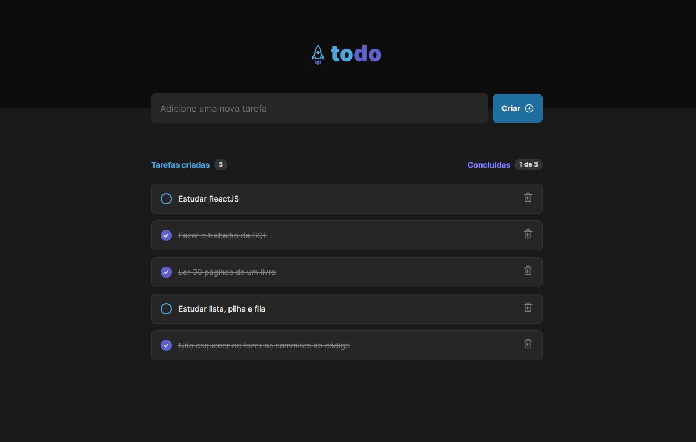

<div style="display: flex; align-items: center; justify-content: space-between;">
    <h1>ToDo List</h1>
    <a href="https://to-do-list-ecru-five.vercel.app/">
        
    </a>
</div>

:star: Por favor, favorite este repositório se achou útil - isso me motiva a continuar.

O ToDo List é um aplicativo para facilitar a organização de tarefas. Você pode anotar tarefas a serem feitas e marcá-las como concluídas quando terminar.

[](https://to-do-list-ecru-five.vercel.app/)

## Tabela de Conteúdo

- [Instalação](#instalação)
- [Tecnologias Utilizadas](#tecnologias-utilizadas)
- [Funcionalidades](#funcionalidades)

## Instalação

Para este projeto, você precisará do Node.js e do npm instalados em seu ambiente.

1. Clone o repositório:
   ```bash
   git clone https://github.com/paulogarbo/ToDo-List.git
   cd ToDo-List
   ```

2. Instale as dependências do projeto:
   ```bash
   npm install
   ```

3. Inicie o servidor de desenvolvimento:
   ```bash
   npm run dev
   ```

## Tecnologias Utilizadas

- [](https://vitejs.dev/)
- [](https://reactjs.org/)
- [](https://www.typescriptlang.org/)

## Funcionalidades

- Adicionar novas tarefas.
- Marcar tarefas como concluídas.
- Excluir tarefas.
- Armazenamento em cache das tarefas.

## Licença

Este projeto está licenciado sob a [Licença MIT](https://opensource.org/licenses/MIT)